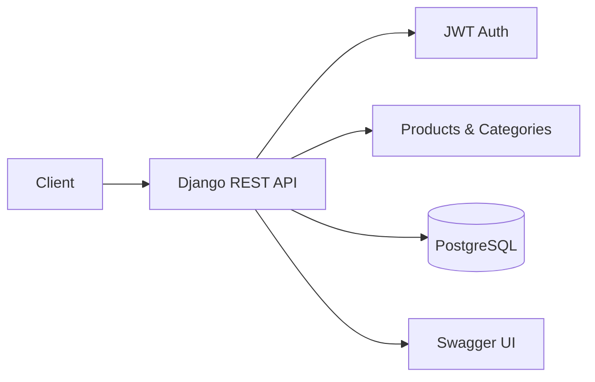
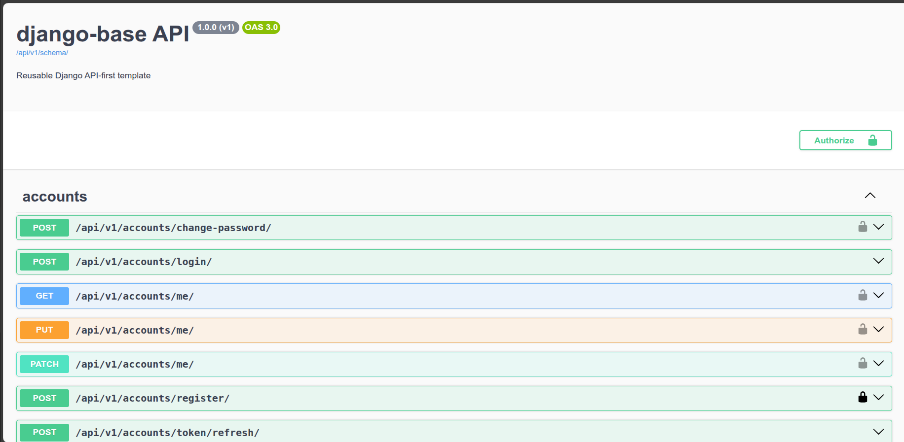
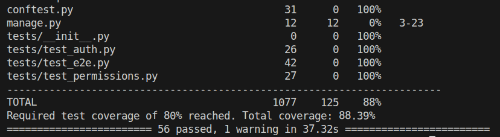
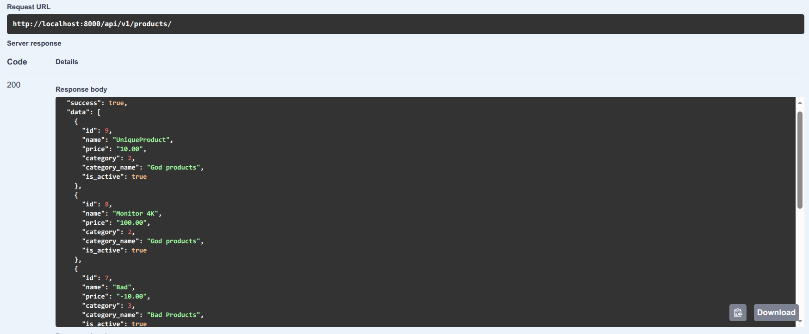
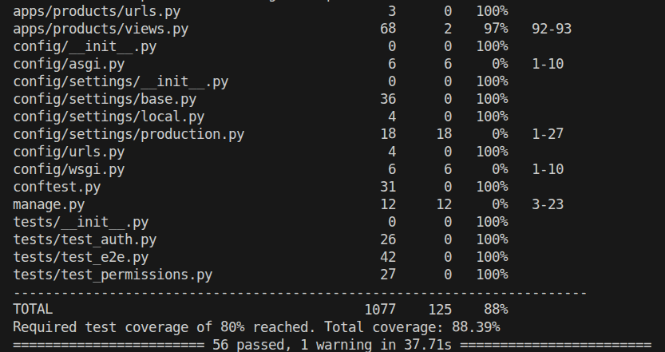

# django-base

[](https://github.com/GaboBlack00/django-base/actions/workflows/ci.yml)
[](https://python.org)
[](https://djangoproject.com)
[](https://django-rest-framework.org)
[](LICENSE)
[]()
[]()



A production-ready Django API starter template with JWT auth, complete CRUD for products/categories, comprehensive test coverage, and Docker/Podman support.

## Features

- **Django 6.0** with **Django REST Framework 3.16**
- **JWT authentication** via SimpleJWT (access + refresh tokens)
- **Custom user model** with email-based login (no username)
- **Products & Categories** module with full CRUD, filtering, search, and ordering
- **Role-based permissions**: product ownership, staff-only category management
- **Rate limiting** for login, anonymous, and authenticated endpoints
- **Request tracing**: unique `X-Request-ID` per request
- **Structured API responses**: consistent `{success, data}` / `{success, error}` envelope
- **OpenAPI/Swagger** documentation auto-generated via drf-spectacular
- **56+ tests** with pytest, coverage tracking, and CI integration
- **PostgreSQL** in all environments (local, test, production)
- **Docker Compose** ready (works with both Docker and Podman)
- **Environment-based settings** via django-environ (local/production)
- **Production-ready**: Gunicorn, WhiteNoise, Sentry-ready, CORS, clickjacking protection

---

## Test Results


| Suite | Tests | Status |
|-------|-------|--------|
| Accounts | 24 | ✅ |
| Products | 20 | ✅ |
| E2E | 8 | ✅ |
| Permissions | 4 | ✅ |
| **Total** | **56** | **✅ 100%** |

## Screenshots

<figure>
    
    <figcaption>Swagger UI with auto-generated API documentation</figcaption>
</figure>

<figure>
    
    <figcaption>56 passing tests with pytest</figcaption>
</figure>

<figure>
    
    <figcaption>Structured JSON API response</figcaption>
</figure>

<figure>
    
    <figcaption>Coverage report with 88%+ coverage threshold</figcaption>
</figure>

---

## Quick Start

### Prerequisites

- Python 3.12+
- Docker (or Podman) + Docker Compose

### Local Development

1. Clone and enter the project:
```bash
git clone https://github.com/GaboBlack00/django-base.git
cd django-base
```

2. Copy environment variables:
```bash
cp .env.example .env
```

3. Start the services:
```bash
docker compose up
```

4. Create a superuser (in another terminal):
```bash
docker compose exec api python manage.py createsuperuser
```

5. Open in your browser:
    - API: http://localhost:8000/api/v1/
    - Swagger docs: http://localhost:8000/api/v1/docs/
    - Admin: http://localhost:8000/admin/

### Running Tests

```bash
docker compose exec api pytest
```

Or with coverage:
```bash
docker compose exec api pytest --cov=. --cov-report=term-missing
```

### Running Without Docker

```bash
python -m venv .venv
source .venv/bin/activate
pip install -r requirements.txt
python manage.py migrate
python manage.py runserver
```

## Project Structure

```
django-base/
├── apps/
│   ├── accounts/         # User authentication & profile (JWT register/login/refresh)
│   ├── core/             # Shared infrastructure (middleware, permissions, throttles, mixins)
│   └── products/         # Products & Categories CRUD module
├── config/
│   └── settings/         # Django settings by environment (base, local, production)
├── tests/                # Integration and end-to-end tests
├── docker-compose.yml    # Local development stack
├── Dockerfile            # Production Docker image
├── entrypoint.sh         # Container entrypoint (migrations, static files)
└── pyproject.toml        # Project metadata, dependencies, tool config
```

---

## API Endpoints

### Authentication
| Method | Endpoint | Description |
|--------|----------|-------------|
| POST | `/api/v1/accounts/register/` | Create a new user |
| POST | `/api/v1/accounts/login/` | Get JWT access + refresh tokens |
| POST | `/api/v1/accounts/token/refresh/` | Refresh an expired access token |
| GET | `/api/v1/accounts/me/` | Get current user profile |
| PATCH | `/api/v1/accounts/me/` | Update current user profile |
| POST | `/api/v1/accounts/change-password/` | Change current user password |

### Products
| Method | Endpoint | Description |
|--------|----------|-------------|
| GET | `/api/v1/products/` | List products (filterable, searchable, sortable) |
| POST | `/api/v1/products/` | Create a product (authenticated) |
| GET | `/api/v1/products/{id}/` | Product detail |
| PUT | `/api/v1/products/{id}/` | Update product (owner/staff only) |
| PATCH | `/api/v1/products/{id}/` | Partial update product (owner/staff only) |
| DELETE | `/api/v1/products/{id}/` | Delete product (owner/staff only) |

### Categories
| Method | Endpoint | Description |
|--------|----------|-------------|
| GET | `/api/v1/products/categories/` | List all categories |
| POST | `/api/v1/products/categories/` | Create category (staff only) |
| GET | `/api/v1/products/categories/{id}/` | Category detail |
| PUT | `/api/v1/products/categories/{id}/` | Update category (staff only) |
| PATCH | `/api/v1/products/categories/{id}/` | Partial update category (staff only) |
| DELETE | `/api/v1/products/categories/{id}/` | Delete category (staff only) |

### Documentation
| Method | Endpoint | Description |
|--------|----------|-------------|
| GET | `/api/v1/schema/` | OpenAPI schema (JSON) |
| GET | `/api/v1/docs/` | Swagger UI |

---

## Tech Stack

| Layer | Technology |
|-------|------------|
| **Framework** | Django 6.0.6 |
| **API** | Django REST Framework 3.16 |
| **Auth** | SimpleJWT 5.5 |
| **Docs** | drf-spectacular + Swagger |
| **Database** | PostgreSQL 16 |
| **Task Runner** | Gunicorn (production) / runserver (dev) |
| **Container** | Docker + Docker Compose |
| **Testing** | pytest, pytest-django, pytest-cov |
| **Linting** | Ruff |

## Development Commands

```bash
make test        # Run all tests with coverage
make lint        # Run ruff linter
make format      # Run ruff formatter
make migrate     # Apply database migrations
make shell       # Open Django shell
make superuser   # Create a superuser
```

## License

MIT License — see [LICENSE](LICENSE) for details.
